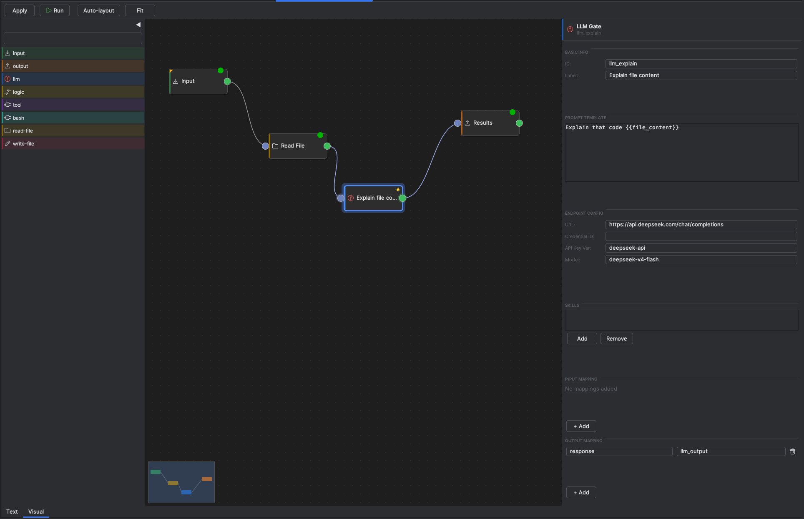
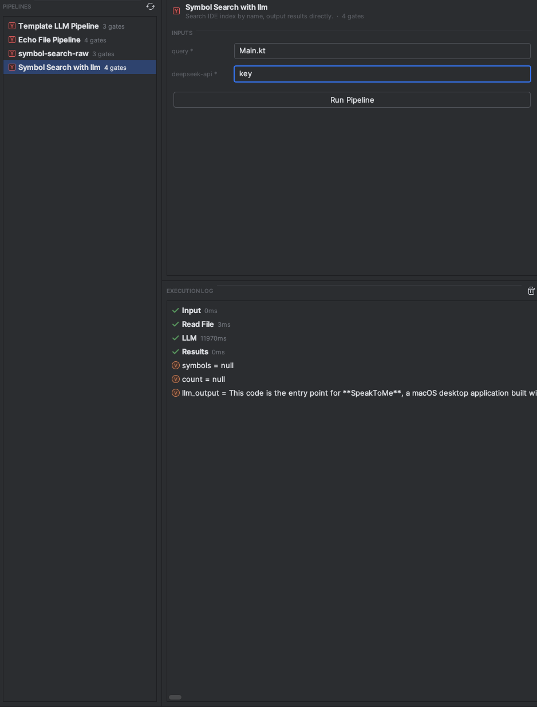
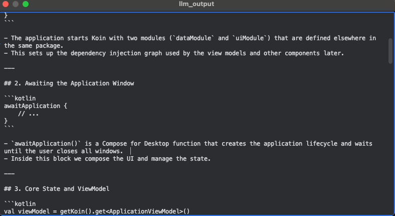

# flai


[](https://plugins.jetbrains.com/plugin/31958-flai)
[](https://plugins.jetbrains.com/plugin/31958-flai)

> **Agentic pipelines for your IDE.** Wire LLMs, IDE tools, shell commands, and file I/O into reusable YAML workflows — and run them from a gutter icon.

<!-- Plugin description -->
**flai** turns IntelliJ-based IDEs into an agent runtime. Define multi-step LLM pipelines as plain YAML, drop them in <code>.flai/</code>, and run them on any file with a single click — straight from a gutter icon or a dedicated tool window. No external orchestrator, no separate app, no copy-paste between a chat window and your editor.

Each pipeline is a graph of <b>gates</b> connected by edges. Outputs of one gate flow into the next through a shared execution context, so you can chain an LLM call into a shell command into a file write without glue code.

<b>Gate types:</b>
<ul>
  <li><b>input</b> — entry point; seeds context from a typed schema (string / number / boolean / JSON).</li>
  <li><b>llm</b> — calls an LLM endpoint with a templated prompt and optional reusable skills. Anthropic and OpenAI response shapes supported out of the box.</li>
  <li><b>logic</b> — branches execution on context variables (comparison, switch, always).</li>
  <li><b>tool</b> — invokes a built-in IDE tool: file read, symbol search, run command.</li>
  <li><b>bash</b> — runs a non-interactive shell command with timeout and env overlay.</li>
  <li><b>read-file / write-file</b> — move data between disk and context.</li>
  <li><b>output</b> — terminal gate; surfaces selected results back in the IDE.</li>
</ul>

<b>Why flai:</b>
<ul>
  <li><b>Pipelines as code.</b> YAML files checked into git — reviewable in PRs, diffable, branchable.</li>
  <li><b>Native IDE integration.</b> Gutter run icon on <code>*.flai.yaml</code> and <code>*.flai</code> files, plus a live execution log.</li>
  <li><b>Bring your own model.</b> Endpoint and credentials configured per gate.</li>
  <li><b>Skills, not megaprompts.</b> Compose reusable instruction files (<code>.flai/skills/*.md</code>) per LLM gate.</li>
  <li><b>Secrets stay local.</b> LLM API keys resolve from a pipeline context variable (<code>apiKeyVar</code>) or from IntelliJ's <code>PasswordSafe</code> (<code>flai/&lt;credentialId&gt;</code>) — never written to YAML.</li>
</ul>

Built for engineers who want their AI workflows to live in the same repo as the code they operate on — versioned, reviewable, and runnable without leaving the IDE.

<p><b>Documentation:</b> <a href="https://github.com/CrazyApple888/flai">github.com/CrazyApple888/flai</a> — full <a href="https://github.com/CrazyApple888/flai/blob/main/docs/pipeline-yaml-spec.md">pipeline YAML specification</a>, examples, and gate reference.</p>
<!-- Plugin description end -->

---

## Screenshots

<div align="center">
  <br/>
  <sub><b>Visual editor</b> — drag-and-drop pipeline graph with per-gate config panel</sub>
</div>

<br/>

<table>
  <tr>
    <td align="center" width="45%">
      <br/>
      <sub><b>Tool window</b> — pick a pipeline, fill inputs, watch the execution log</sub>
    </td>
    <td align="center" width="55%">
      <br/>
      <sub><b>Output</b> — LLM response surfaced directly in the IDE</sub>
    </td>
  </tr>
</table>

---

## Why flai

- **Pipelines as code.** YAML files in `.flai/`, checked into git. Reviewable in PRs, diffable, branchable.
- **Native IDE integration.** Gutter run icon on `*.flai.yaml` and `*.flai` files, dedicated tool window, live execution log.
- **Bring your own model.** Anthropic and OpenAI response shapes supported out of the box. Endpoint and credentials per-gate.
- **Tools that touch your code.** Built-in `ide.readFile`, `ide.searchSymbol`, `ide.runCommand`, plus first-class `bash`, `read-file`, and `write-file` gates.
- **Skills, not megaprompts.** Compose reusable instruction files (`.flai/skills/*.md`) per LLM gate.
- **Branching logic.** `logic` gates with `comparison` / `switch` / `always` conditions route execution across paths.
- **Secrets stay local.** LLM API keys resolve from a pipeline context variable (`apiKeyVar`) or via IntelliJ `PasswordSafe` under `flai/<credentialId>`. Never written to YAML.

## Gate types

| Gate         | Purpose                                                                   |
|--------------|---------------------------------------------------------------------------|
| `input`      | Entry point. Seeds context from typed schema (`STRING`/`NUMBER`/`BOOLEAN`/`JSON`). |
| `llm`        | Calls an LLM endpoint with templated prompt and optional skills.          |
| `logic`      | Branches on context variables (comparison, switch, always).               |
| `tool`       | Invokes a registered IDE tool (file read, symbol search, run command).    |
| `bash`       | Runs a non-interactive shell command with timeout and env overlay.        |
| `read-file`  | Reads a file from disk into context.                                      |
| `write-file` | Writes a context variable to disk (`overwrite` / `append` / `fail-if-exists`). |
| `output`     | Terminal gate. Surfaces selected context values as final results.         |

Full spec: [`docs/pipeline-yaml-spec.md`](docs/pipeline-yaml-spec.md).

## Quick start

1. **Install** flai (see below).
2. Create `.flai/` at your project root.
3. Drop in a pipeline file, e.g. `.flai/code-review.flai.yaml` (or `.flai/code-review.flai`):

   ```yaml
   id: code-review
   name: Code Review
   entry: inputs

   gates:
     inputs:
       type: input
       schema:
         - { name: file_path, type: STRING, required: true }

     read:
       type: read-file
       path: "{{file_path}}"
       outputKey: file_content

     review:
       type: llm
       promptTemplate: |
         Review this code for correctness and style:

         ```
         {{file_content}}
         ```
       endpoint:
         url: https://api.anthropic.com/v1/messages
         credentialId: anthropic-key
         model: claude-sonnet-4-6

     result:
       type: output
       outputMapping: { review: response }

   edges:
     - { from: inputs, to: read }
     - { from: read,   to: review }
     - { from: review, to: result }
   ```

4. **Store your API key.** `Settings → Appearance & Behavior → System Settings → Passwords`, add entry under service name `flai/anthropic-key`.
5. **Run.** Open the YAML file and click the gutter run icon, or use the **Flai Pipelines** tool window on the right.

## Installation

- **From JetBrains Marketplace** (recommended):
  <kbd>Settings/Preferences</kbd> → <kbd>Plugins</kbd> → <kbd>Marketplace</kbd> → search **flai** → <kbd>Install</kbd>

- **From the marketplace site:** [plugins.jetbrains.com/plugin/31958-flai](https://plugins.jetbrains.com/plugin/31958-flai) → <kbd>Install to ...</kbd>

- **Manually:** download the [latest release](https://github.com/CrazyApple888/flai/releases/latest) →
  <kbd>Settings/Preferences</kbd> → <kbd>Plugins</kbd> → <kbd>⚙️</kbd> → <kbd>Install plugin from disk…</kbd>

**Compatibility:** IntelliJ IDEA 2025.2+ (and other IntelliJ Platform IDEs on the same build).

## CLI

Run the same pipelines from the terminal — no IDE required. `flai-cli` is a non-interactive runner packaged as a fat JAR (Java 21+), built for CI.

```bash
# grab it from the latest release, or build from source:
./gradlew :cli:fatJar   # -> cli/build/libs/flai-cli-<version>.jar

java -jar flai-cli.jar run .flai/code-review.flai.yaml --input file_path=src/Main.kt
java -jar flai-cli.jar run .flai/code-review.flai.yaml --inputs-json inputs.json --format json --quiet
```

- **Same YAML, same gates.** The only IDE-only piece is the PSI symbol search tool.
- **CI-friendly.** Final outputs on stdout (`text` or `json`), event log on stderr, meaningful exit codes.
- **Credentials via env vars.** No PasswordSafe in the terminal — `credentialId: anthropic-key` resolves from `FLAI_CREDENTIAL_ANTHROPIC_KEY`.

Full reference (options, exit codes, GitHub Actions example): [`docs/cli.md`](docs/cli.md).

## Architecture

Hexagonal — pure-Kotlin domain, IntelliJ-aware infrastructure, Swing UI.

```
domain/         Pipeline, Gate (sealed), ExecutionContext, ports
usecase/        ListPipelines, LoadPipeline, RunPipeline
infrastructure/ executors per gate, HttpLlmClient, YAML parser, IDE tools
ui/             tool window, gutter marker, FlaiPipelineUiService (StateFlows)
```

Adding a new gate type: sealed subclass in `Gate.kt` → `DefaultXxxGateExecutor` → wire in `FlaiPipelineUiService` → parser branch in `YamlPipelineParser.parseGate()`. See [`CLAUDE.md`](CLAUDE.md) for full conventions.

## Development

```bash
./gradlew runIde         # launch sandbox IDE with the plugin
./gradlew test           # run tests
./gradlew buildPlugin    # produce distributable ZIP
./gradlew verifyPlugin   # check IDE compatibility
./gradlew :cli:fatJar    # build the CLI fat JAR
```

## Roadmap

- [x] **CLI tool** — run `.flai.yaml` / `.flai` pipelines from the terminal, outside the IDE. Same YAML, same gate types, no IntelliJ required. CI-friendly. See [`docs/cli.md`](docs/cli.md).
- [ ] **Tool calling** — let LLM gates call registered tools (function calling): the model decides which tool to invoke, the executor runs it and feeds results back until a final answer.
- [ ] **MCP server** — expose flai pipelines as MCP tools so any MCP-compatible host (Claude Desktop, other agents) can invoke them directly.
- [ ] **HTTP gate** — make arbitrary HTTP requests (GET/POST/etc.) from a pipeline; response body and status stored in context.
- [ ] **Vector/RAG gate** — embed text and query a vector store; inject retrieved chunks into context for downstream LLM gates.
- [ ] **Parallel gate** — fan-out execution across multiple branches concurrently; collect results before continuing.

## Documentation

- [Pipeline YAML specification](docs/pipeline-yaml-spec.md) — every gate, every field, every example.
- [CLI reference](docs/cli.md) — options, inputs, credentials, exit codes, CI usage.